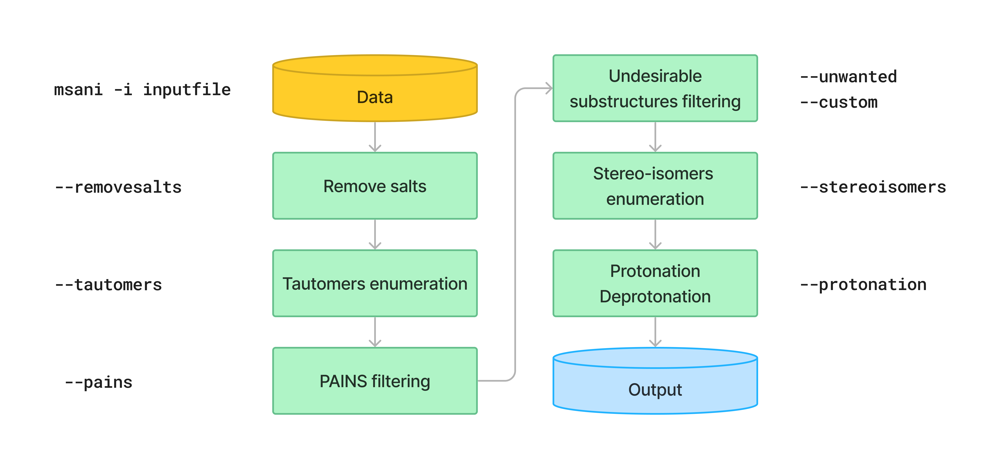

# MolSanitizer - A package to prepare SMILES databases

MolSannitizer is a package for preparation (remove salts, stereoisomers enumeration, protonation, ...) and filtering undesirable substructures (PAINS, reactive functional groups, ...) for drug discovery projects.

# Installation (CONDA environment)

We will set up the environment using [Anaconda](https://docs.anaconda.com/anaconda/install/index.html). Clone the
current repository:

    git clone https://github.com/Isra3l/MolSanitizer.git
    
Example of how to set up a working conda environment to run the code:

    conda env create -f MolSanitizer/environment.yml
    conda activate msani
    pip install -e MolSanitizer

# Usage

## Input

The program requires a white-space or tab-delimited file containing two columns (SMILES, moleculeID) without headers.

```
COCCC(=O)Nc1ncc(s1)Br  CP000000418470
C1CC(C(=O)NC1)SCCC=CBr  CP000000432409
CC(C)(C)CNC(=O)c1ccsc1Br  CP000001634597
c1c(coc1Br)C(=O)NC2CCSC2  CP000001645677
c1c(c([nH]n1)C(=O)NCC2(CC2)N)Br  CP000001647414
```

## **Overview**
The pipeline contains six preparation and/or filtering steps, which could be used simultaneously to prepare the database:

This is an example of a lazy pipeline that use all the preparation steps:

```bash
msani -i example.smi --removesalts --tautomers --pains --unwanted all --stereoisomers --protonation
```

**Use the `--help (-h)` flag for more information.**


By default, the program produces a new file with a **_clean** suffix. If the PAINS or unwanted filters are applied, the rejected molecules with the reason for rejection will be output by **_rejected** suffix.

The program by default will conduct the preparation and filtering in the order below:



## **Option 1: Remove salts**
 To use the remove salts function, simply use `--removesalts` flag. The program uses a predefined salt list in [MolSanitizer/Data/salt_stripping.txt](MolSanitizer/Data/salt_stripping.txt) to remove the salts, which contain both organic and inorganic salts commonly used in medicinal chemistry. 

*Caution:* if the entry is an organic salt (eg. sodium acetate CH<sub>3</sub>COO<sup>-</sup>Na<sup>+</sup>), the whole entry will be removed.
```bash
msani -i example.smi --removesalts
```

## **Option 2: Tautomers enumeration**
The tautomers could be generated using a `--tautomers` flag. MolSanitizer uses a two-step approach for enumeration of tautomers. First, the canonical tautomer from the scoring function of rdMolStandardize.TautomerEnumerator was used. Then, the exceptions were corrected using the expert-curated SMARTS rules. The SMARTS rules are readily accessible at [MolSanitizer/Data/tautomers.txt](MolSanitizer/Data/tautomers.txt)

```bash
msani -i example.smi --tautomers
```

## **Option 3: PAINS filtering**
Molecules that contain PAINS substructures could be efficiently eliminated using the `--pains` flag. The violated structures would be stored in the **_rejected** file.

```bash
msani -i example.smi --pains
```

Example of the **_rejected** output is as below:
```
CCOc1cccc(C=C2C(=O)N(Cc3ccccc3)C(C)=C2C(=O)OC)c1O Z57339064     "PAINS violation: Ene_five_het_c(85)"
N#Cc1ccccc1COC(=O)c1cccc2c1C(=O)c1ccccc1C2=O      Z18301252     "PAINS violation: Quinone_a(370)"
Nc1sc2c(c1C(=O)c1ccccc1)CCC2                      Z1259205366   "PAINS violation: Thiophene_amino_aa(45)"
COCC1(CC(=O)NCc2cc(O)ccc2O)CC1                    Z2832180283   "PAINS violation: Mannich_a(296)"
CCCCN(Cc1ccc(OS(=O)(=O)F)cc1)Cc1ccccc1O           Z4607533150   "PAINS violation: Mannich_a(296)"
```

## **Option 4: Unwanted substructures filtering**
Molecules that contain unwanted substructures could be efficiently eliminated using the `--unwanted` flag. MolSanitizer uses an expert-curated list that contains undesirable substructures, accompanied by the reasons and references for filtering. The list could be obtained from [MolSanitizer/Data/filter_out.csv](MolSanitizer/Data/filter_out.csv). 

There are four options accompanied by the `--unwanted` flag, which are *['all', 'regular', 'special', 'optional']*. An unspecified option would result in the *regular* filters. The choice of the options would depend on the user and vary between targets.

```bash
msani -i example.smi --unwanted
msani -i example.smi --unwanted regular #By default 
msani -i example.smi --unwanted regular special 
msani -i example.smi --unwanted all
```

It is also possible to filter out the customized unwanted substructures, depending on the preference of the user using a customized SMARTS list. To generate a template for this list, use `--create_custom` flag. This will result in the **templates.tsv** file.

```bash
msani --create_custom
```

The first two columns (SMARTS and LABEL) are required for the program to parse while the remaining columns would be omitted by the program. To filter using the customized list, use the `--custom` flag with the path to the customized list file. It is also possible to apply both the available filters with the customized filters.

```bash
msani -i example.smi --custom templates.tsv
msani -i example.smi --unwanted all --custom templates.tsv
```

## **Option 5: Stereoisomers enumeration**
Stereoisomers enumeration will be considered for nonspecified chiral centers using the `--stereoisomers` flag. For an entry that contains multiple stereoisomers, its ID would be expanded (Eg. mol8 -> mol8_1 mol8_2).

```bash
msani -i example.smi --stereoisomers

# Input:
# C1C2CC3CC1CC(C2)(C3O)N                            mol8

# Output:
# N[C@@]12C[C@@H]3C[C@@H](C[C@@H](C3)[C@H]1O)C2     mol8_1
# N[C@@]12C[C@@H]3C[C@@H](C[C@@H](C3)[C@@H]1O)C2    mol8_2
```

It is possible to define the maximum number of stereoisomers generated for each molecule by adding the `--max_isomers` flag.

```bash
msani -i example.smi --stereoisomers --max_isomers 30
```

## **Option 6: Protonation**
The protonation stage could be assigned to the molecules using the `--protonation` flag. The program uses SMARTS reactions to iteratively assign the protonation stages to the atoms. The SMARTS reactions could be obtained from [MolSanitizer/Data/ionizations.txt](MolSanitizer/Data/ionizations.txt). If there are multiple possibilities of protonation, the output will be expanded.

```bash
msani -i example.smi --protonation

# Input:
# O=C(N1C(C2C(C1)C2O)C(O)=O)CN3CCNCC3 mol4_editted

# Output:
# O=C([O-])C1C2C(O)C2CN1C(=O)CN1CC[NH2+]CC1 mol4_editted_1
# O=C([O-])C1C2C(O)C2CN1C(=O)C[NH+]1CCNCC1 mol4_editted_2
```
