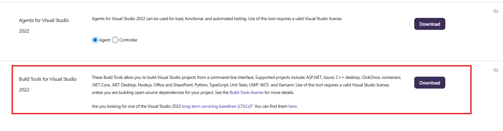
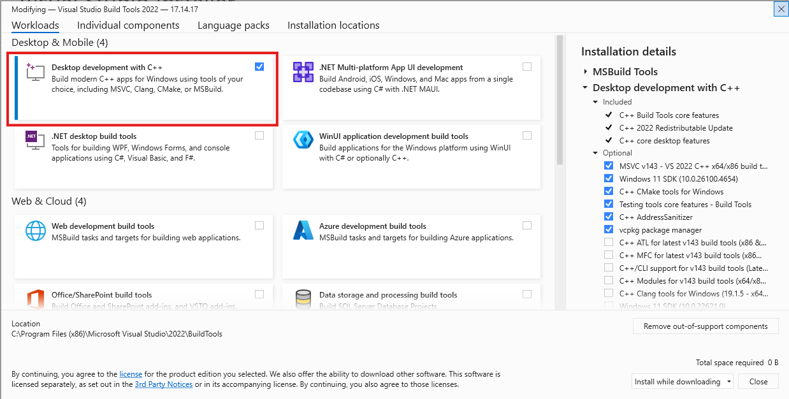

Installation
=============================

Supported environments
----------------------

Package metadata requires Python ``>=3.10,<3.15`` and RDKit ``>=2025.3.1``.
The source-build Conda environment requests RDKit ``>=2025.9.1``. These are
installation requirements; they do not mean every permitted combination has
been tested.

The September 17, 2026 manuscript reports the following tested environments:

.. list-table:: Reported platform testing
   :header-rows: 1
   :widths: 40 20 25 15

   * - Operating system
     - Python
     - RDKit
     - SLURM batch
   * - Ubuntu 20.04, 22.04, 24.04
     - 3.10–3.14
     - 2025.9.1–2026.3.6
     - Yes
   * - Rocky Linux 9.5 / CentOS 7
     - 3.10–3.14
     - 2025.9.1–2026.3.6
     - Yes
   * - Windows 11 (x64)
     - 3.10–3.12
     - 2025.9.1–2026.3.6
     - Not applicable
   * - macOS 14, 15 (x64 and ARM64)
     - 3.10–3.14
     - 2025.9.1
     - Not applicable

These reported ranges are not a guarantee of testing every version combination
or of a prebuilt wheel for each platform. PDBQT output requires the optional
Meeko dependencies; batch submission requires a SLURM cluster.

Dependencies
------------

MolSanitizer is built upon the following packages:

- RDKit
- pandas
- numpy

Optional dependencies
---------------------

- `Meeko <https://pypi.org/project/meeko/>`_ is required only for PDBQT output.
  Install it with ``pip install "molsanitizer[pdbqt]"``.

- `Open Babel <https://openbabel.org/docs/dev/Installation/install.html>`_ is
  required only when ``obabel`` is selected as the embedding method or used as
  the fallback after an RDKit embedding timeout. If it is unavailable after a
  timeout, MolSanitizer records the reason in ``msani_error.err`` and continues
  with the remaining molecules.

Installation
------------

Installation of MolSanitizer can be done either from PyPI or by building from source. The recommended way is to install it from PyPI.

From PyPI
^^^^^^^^^^^

.. code-block:: console

   $ pip install molsanitizer

In order to also generate PDBQT files, install the optional dependency Meeko:

.. code-block:: console

   $ pip install "molsanitizer[pdbqt]"

From Conda-forge
^^^^^^^^^^^^^^^^^^

.. code-block:: console

   $ conda install -c conda-forge molsanitizer

Building from source
------------------------

.. warning::

    Building MolSanitizer from source is NOT meant to be done by regular users!

We will set up the environment using `Anaconda <https://docs.anaconda.com/anaconda/install/index.html>`_.

.. code-block:: console

   $ git clone https://github.com/carlssonlab/MolSanitizer.git
    

Mac OS and Linux
^^^^^^^^^^^^^^^^^^

For UNIX-based systems (Mac OS and Linux), the installation and building process could be done quite straightforwardly. In the same folder as previous steps, use:

.. code-block:: console
   
   $ conda env create -f MolSanitizer/environment.yml
   $ conda activate msani
   $ pip install -e MolSanitizer

Windows
^^^^^^^^^

The installation in Windows requires the installation of Microsoft Visual Studio (VS) with C++ build tools, which can be downloaded from `here <https://visualstudio.microsoft.com/downloads/?cid=learn-onpage-download-install-visual-studio-page-cta>`_. Scroll down and only Download the option "Build Tools for Visual Studio 2022".

Then, during the installation, make sure to select the "Desktop development with C++" workload, as shown below:

After installing Visual Studio, you can proceed with the installation of MolSanitizer. In the same folder as previous steps, use:

.. code-block:: console

   $ conda env create -f MolSanitizer/environment.yml
   $ conda activate msani
   $ pip install -e MolSanitizer

Testing
-------

MolSanitizer uses `unittest <https://docs.python.org/3/library/unittest.html>`_ for testing. To run the tests, use the following command:

In the same folder as previous steps, use:

.. code-block:: console

   $ python -m unittest MolSanitizer/test/test_msani.py

The test takes around 1-2 minutes to complete.
