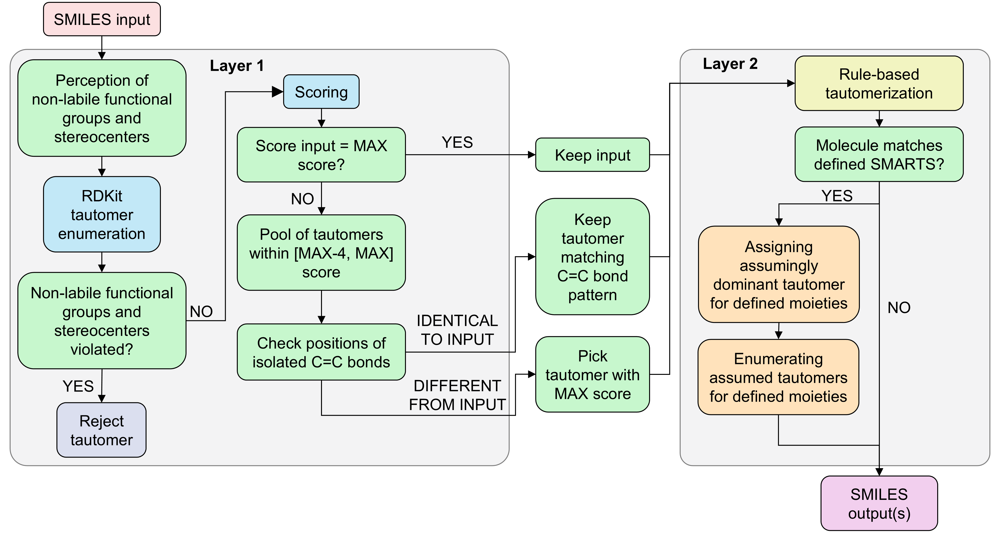
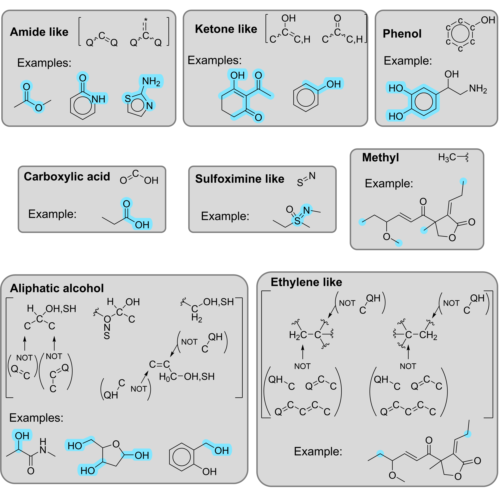
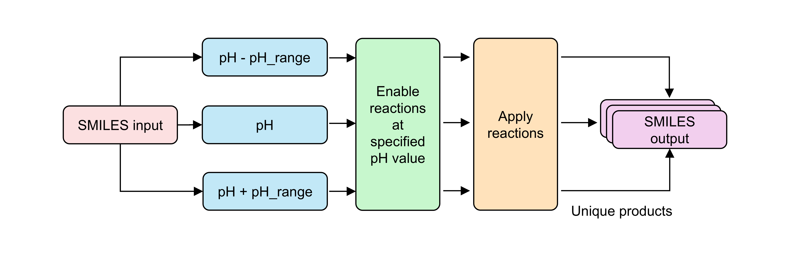
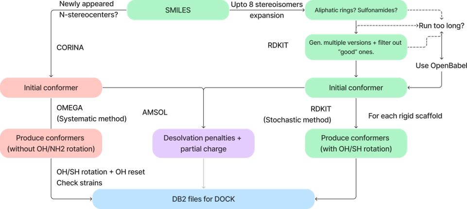

Introduction
############

In this page, you can find the overview of the algorithm and the main features of MolSanitizer. The documentation is organized into several sections, each covering a specific aspect of the software. The main topics include:

.. contents:: Table of Contents
   :depth: 2
   :local:
   :backlinks: none

1. Tautomerization
=====================

Introduction
----------------

Tautomers are interconvertible structural isomers of a molecule that differ in the placement of protons and electrons. They are highly relevant in drug discovery, as distinct tautomeric forms can display different physicochemical properties and biological activities. Among the various tautomerization mechanisms, prototropic tautomerization is the most common and important, where the migration of a proton leads to the formation of alternative isomers:a

.. math::

   H-X-Y=Z ↔ X=Y-Z-H

Because tautomerization is a complex and not yet fully solved problem, MolSanitizer restricts its focus to determining tautomeric states in aqueous solution at physiological pH. This assumption reduces the number of plausible tautomers and enhances practical relevance. To accomplish this, MolSanitizer adopts a two-layer approach to identify the most chemically reasonable tautomer for a given molecule:

|

| In the following sections, we will discuss the two layers of tautomer canonicalization in MolSanitizer:

Layer 1: Tautomer canonicalization using RDKit
------------------------------------------------

The process begins with an evaluation of the input molecule to identify defined stereocenters and functional groups that are considered non-migratable. This is done using SMARTS matching, which allows the program to recognize specific substructures and their properties. The functional groups that are considered non-migratable include:

   
|

The next step is tautomer enumeration using the RDKit tautomer enumerator (originally from the MolVS project) [2]_. Any tautomers that disrupt the integrity of non-tautomerizable functional groups identified in the input molecule are discarded.

The remaining tautomers are then ranked based on a modified scoring function that inspired from [1]_ , where the score for each tautomer is calculated by the sum of the following substructures:

.. math::

   \mathrm{score} = \sum_{i=1}^{n} \text{aromatic ring}_i \cdot 100 + \sum_{i=1}^{m}\text{N}_{\text{substructures}_i} \cdot \text{score}_{\text{substructures}_i} - \sum_{i=1}^{k} \text{X-H}

Here, n denotes the number of aromatic rings; m is the number of substructures (below) presented in the molecule; N is the occurence of the substructure m; and k is the number of X–H (the number of hydrogen atoms bound to P, S, Se, or Te atoms). Each aromatic ring contributes 100 points, while substructure-specific scores (score\ :sub:substructure i) are assigned according to the table below:

.. code-block:: python

      {{"oxim", "[#6]=[N][OH]", 4},
      {"N=O", "[#7]=,:[#8]", 2},
      {"P=O", "[#15]=,:[#8]", 2},
      {"C=hetero", "[#6]=[!#1;!#6]", 1},
      {"guanidine terminal=N", "[#7][#6](=[NR0])[#7H0]", 1},
      {"guanidine endocyclic=N", "[#7;R][#6;R]([N])=[#7;R]", 2},
      {"aci-nitro", "[#6]=[N+]([O-])[OH]", -4},
      {"thiophene", "[#6]:[#16]", 2},
      {"carbonyl", "[#6]=[#8,#16]", 2},
      {"aromatic benzoquinone", "[c;$(c1(=A)c(:a)cccc1),$(c1(=A)ccc(:a)cc1)]1[c;!$(c12c(=A)c3c(cccc3)cc1ccc(:a)c2)!$(c12c(=A)c3c(cccc3)cc1cc(:a)cc2)!$(c12c(=A)c3c(cc(:a)cc3)cc1cccc2)!$(c12c(=A)c3c(ccc(:a)c3)cc1cccc2)!$(c12cc3c(cc(:a)cc3)cc1cccc2=A)!$(c12cc3c(ccc(:a)c3)cc1cccc2=A)!$(c1c(=A)c2c(cc3c(ccc(:a)c3)c2)cc1)!$(c1c(=A)c2c(cc3c(cc(:a)cc3)c2)cc1)]cccc1", -100},
      {"p-benzoquinone", "[#6]1(-[#6]=,:[#6]-[#6](-[#6]=,:[#6]-1)=,:[N,S,O])=,:[N,S,O]", 94},
      {"o-benzoquinone", "[#6]1(-[#6](=,:[N,S,O])-[#6]=,:[#6](-[#6]=,:[#6]-1))=,:[N,S,O]", 94},
      {"2-or-3-OH furane and di-OH-pyrrols", "[a;$(c1([OH])[c!$(c~[OX1,OH,SX1,SX2H])][o,s][c!$(c~[OX1,OH,SX1,SX2H])][c!$(c~[OX1,OH,SX1,SX2H])]1),$([c!$(c~[OX1,OH,SX1,SX2H])]1c([OH])[o,s][c!$(c~[OX1,OH,SX1,SX2H])][c!$(c~[OX1,OH,SX1,SX2H])]1),$(c1([OH])[nX3]c([OH])[c!$(c~[OX1,OH,SX1,SX2H])][c!$(c~[OX1,OH,SX1,SX2H])]1),$(c1([OH])[nX3][c!$(c~[OX1,OH,SX1,SX2H])]c([OH])[c!$(c~[OX1,OH,SX1,SX2H])]1)]1aaaa1", -99}}

Tautomers with scores within the range [max_score - 4, max_score] are further filtered based on the placement of isolated double bonds. Because multiple high-scoring tautomers may differ in the position of isolated double bonds, priority is given to those that preserve the same positions as the input molecule. If none of the candidates retain the original double-bond configuration, the highest-scoring tautomer is selected as the canonical form. In cases of tie or no tautomer that can comply with all the requirements, the lexicographically smallest tautomer is chosen.

Layer 2: Rule-based tautomerism
-------------------------------

Output from the first layer is then processed by a set of SMARTS reactions to ensure that the tautomer is in the most stable form. The SMARTS reactions are designed to correct the tautomer to its most stable form based on the literature. The reactions are applied iteratively until no further changes can be made, ensuring that the final tautomer is chemically stable and biologically relevant. In case of multiple possibilities of tautomerization (eg. imidazole), the output will be expanded to include all possible tautomers. The SMARTS rules are readily accessible at `msani/Data/tautomers_v3.txt <https://github.com/phonglam3103/MolSanitizer/blob/main/msani/Data/tautomers_v3.txt>`_.

2. Ionization
================

Introduction
----------------

Protonation states play a central role in chemistry and biochemistry because they directly affect the structure, stability, solubility, and reactivity of molecules. In drug discovery, the protonation state of a ligand can determine how it interacts with its target protein and influences properties such as permeability and binding affinity. Similarly, in enzymatic processes and catalysis, the distribution of protonation states governs the mechanism and efficiency of reactions.

.. math::

   \begin{align}
   \mathrm{HA} &\rightleftharpoons \mathrm{H^+} + \mathrm{A^-} 
      & \quad \mathrm{K_a} &= \frac{[\mathrm{H^+}][\mathrm{A^-}]}{[\mathrm{HA}]} \\
   \mathrm{RNH_3^+} &\rightleftharpoons \mathrm{RNH_2} + \mathrm{H^+} 
      & \quad \mathrm{K_a} &= \frac{[\mathrm{RNH_2}][\mathrm{H^+}]}{[\mathrm{RNH_3^+}]} \\
   & & \mathrm{p}K_a &= -\log_{10}(\mathrm{K_a})
   \end{align}

The quantitative descriptor of a molecule's proton affinity is the acid dissociation constant (Ka), usually expressed in the logarithm form pKa. By definition, the pKa is the negative logarithm of the equilibrium constant for the dissociation of a proton from a given site. The relationship between pKa and the environmental pH determines the dominant protonation state, given by the Henderson-Hasselbalch equation:

.. math::

   \mathrm{pH} = \mathrm{pKa} + \log\left(\frac{[\mathrm{A^-}]}{[\mathrm{HA}]}\right)

A simple interpretation of the Henderson-Hasselbalch equation is as follows:

- If pH < pKa, the site is more likely to be protonated.
- If pH > pKa, the site is more likely to be deprotonated.
- If pH = pKa, both protonated and deprotonated forms are present equally.

Figure below illustrates the relationship between pH and pKa for a generic acid-base equilibrium:

.. image:: https://upload.wikimedia.org/wikipedia/commons/thumb/a/ab/Weak_acid_speciation.svg/330px-Weak_acid_speciation.svg.png
   :width: 200px
   :align: center

.. raw:: html

   
Relationship between pH and pKa (Source: <a href="https://en.wikipedia.org/wiki/Acid_dissociation_constant">Wikipedia</a>)

|

Approaches for prediction of pKa
---------------------------------

Several approaches have been developed to estimate pKa values. For example, Epik and ACD/Labs utilize the Hammett-Taft equation to correlate between the pKa and linear free energy relationships (LFER) of substituents. Other methods, such as ones based on the molecular structure (eg. ChemAxon Marvin), use correlation between the molecular properties (partial charge) and the pKa values. Quantum mechanical calculations (eg. Jaguar) can also be employed to predict pKa values, but they are computationally expensive and often impractical for large datasets.

Recently, machine learning models have been developed to predict pKa values with high accuracy (Qupcake, Uni-pKa). These models are trained on large datasets of experimentally measured pKa values and can generalize well to unseen molecules. They can also incorporate additional features such as molecular descriptors, functional groups, and chemical environments to improve prediction accuracy.

MolSanitizer's approach
------------------------

Protonation state assignment in MolSanitizer is performed using a library of SMARTS-based reactions tailored to ionizable functional groups. Instead of explicitly predicting numerical pKa values for each site, the method assigns approximate integer pKa values based on the chemical environment and the functional group type. This relies on the assumption that the pKa of a given functional group remains relatively consistent across different molecules, and that local context can guide a reasonable approximation.

For example, all carboxylic acids are assigned a pKa of 4, while aliphatic amines are assigned a pKa of 10. These approximations enable fast and scalable protonation state generation without resorting to computationally expensive quantum mechanical calculations or machine-learning models.

The SMARTS definitions are carefully designed to capture the relevant chemical environment and to avoid chemically implausible assignments, such as:

- Doubly protonated piperazines,
- Protonated amides, and
- Deprotonated phenols lacking electron-withdrawing substituents.

|

Protonation states are assigned according to the relationship between pH and pKa values:

- Acids are deprotonated if the selected pH is ≥ pKa + 1.
- Bases are protonated if the selected pH is ≤ pKa - 1.
- If the pH is approximately equal to the pKa, both neutral and ionized forms are retained.

When a pH range is specified (e.g., 5-9 for near-physiological conditions), the above rules are applied iteratively for each unit within the range. This results in a predictable and controllable enumeration of protomers for drug-like molecules.

The SMARTS reaction library (`msani/Data/ionizations_v3.txt <https://github.com/phonglam3103/MolSanitizer/blob/main/msani/Data/ionizations_v3.txt>`_) is organized such that the most basic groups (highest pKa) and the most acidic groups (lowest pKa) are processed first. Protonation and deprotonation are then applied in the order of decreasing basicity and increasing acidity, ensuring consistency across molecules.

The following substructures are considered for (de)protonation:

.. toggle::

   .. image:: _static/SI-PROTO-RULES_p1.png
      :width: 600px
      :align: center
   .. image:: _static/SI-PROTO-RULES_p2.png
      :width: 600px
      :align: center
   .. image:: _static/SI-PROTO-RULES_p3.png
      :width: 600px
      :align: center

3. Salt Removal
================

4. Stereoisomerism
===================

Introduction
----------------------------

Stereoisomerism occurs when molecules share the same molecular formula and atom connectivity but differ in their three-dimensional arrangement. These spatial differences can profoundly affect molecular properties and biological activity, making stereochemistry a cornerstone of modern drug design. The classic example is thalidomide, where one enantiomer had therapeutic sedative effects while the other caused severe birth defects, highlighting the need to carefully control stereochemistry in pharmaceuticals.

.. image:: https://upload.wikimedia.org/wikipedia/commons/b/bb/Thalidomide-structures.png
   :width: 300px
   :align: center

.. raw:: html

   
Two enantiomers of thalidomides (Left: (S)-thalidomide Right: (R)-thalidomide) (Source: <a href="https://en.wikipedia.org/wiki/Thalidomide">Wikipedia</a>)

|

A key type of stereoisomerism is chirality, where a molecule has a non-superimposable mirror image. Chiral centers, most commonly tetrahedral carbons bonded to four distinct substituents, give rise to enantiomers. Enantiomers often display identical physicochemical properties in achiral environments, but their interactions with chiral systems—such as enzymes, receptors, or transport proteins—can differ dramatically.

Another form is double-bond stereoisomerism, where restricted rotation around a C=C bond leads to different spatial arrangements of substituents. These geometric isomers, classically described as cis/trans or more rigorously as E/Z, frequently exhibit distinct reactivity, stability, and biological activity.

In addition to these classical cases, pseudochiral (para-stereogenic) centers arise when two substituents that are constitutionally identical become stereochemically distinguishable in the presence of other stereogenic elements. Such cases highlight the subtlety of stereochemistry and the role of molecular context in defining stereogenicity.

MolSanitizer's approach
-----------------------

MolSanitizer employs RDKit's EnumerateStereoisomers function to generate all possible stereoisomers for molecules with unspecified stereochemistry. This includes both chiral centers and double-bond stereoisomers, ensuring that all relevant stereochemical configurations are captured. The procedure also accounts for pseudochiral centers, enabling the enumeration of para-stereoisomers when applicable.

Because molecular geometry imposes constraints, not all theoretically possible stereoisomers can be realized in three-dimensional space. To address this, MolSanitizer attempts to embed each enumerated stereoisomer using RDKit's ETKDG algorithm. Any stereoisomer that fails to embed is discarded, while successfully embedded structures are retained for subsequent processing.

5. Filtering
================

PAINS 
---------------

Pan-assay interference compounds (PAINS) [3]_ are well-known sources of assay interference and can lead to false positives in drug discovery. 

MolSanitizer provides a dedicated option to remove PAINS molecules via  the ``--pains`` flag. In addition to removal, the first matched PAINS substructure for each rejected molecule is recorded in a separate output file for reference.

Undesirable and custom substructure filters
-------------------------------------------

Beyond PAINS, MolSanitizer enables filtering of other undesirable substructures using SMARTS pattern matching.

- **Undesirable (--unwanted):**  
  A built-in library of 73 common undesirable substructures is provided 
  (`msani/Data/filter_out.txt <https://github.com/phonglam3103/MolSanitizer/blob/main/msani/Data/filter_out.txt>`_). These are categorized into three levels of severity:

  - *Regular*: Generally unwanted and safe to remove automatically.  
  - *Optional*: May require case-by-case consideration.  
  - *Special*: Removal may depend on prior knowledge of the target or project context.  

- **Custom (--custom):**  
  Users can also define their own SMARTS patterns to remove additional substructures beyond the built-in library. The filtering process is based on the following principles:

For more detailed usage and examples, refer to the :doc:`usage` section.

6. Conformational Sampling
==========================

MolSanitizer utilizes a stochastic conformational sampling approach to generate diverse and representative conformers for molecular structures. Unlike the current DB2 pipeline, which samples all possible conformations with discrete increments, MolSanitizer focuses on sampling only the favorable regions defined by the Torsional Library.

Torsional Library (or TorLib) [4]_, [5]_, [6]_ is a collection of expert-derived SMARTS rules that define preferred torsion angles for small molecules. By matching molecular structures to TorLib, MolSanitizer concentrates on sampling conformations that are more likely to be biologically relevant. This targeted approach reduces computational overhead while ensuring the generation of meaningful conformers. The workflow of the conformational sampling process is illustrated in the figure below.

----

The first step involves generating an initial conformer using the srETKDGv3 (small-ring ETKDGv3) algorithm of RDKit [7]_. However, this algorithm can sometimes produce unfavorable ring conformations such as "boat" or "twist" forms. To address this, MolSanitizer generates up to 100 conformers and filters out the undesirable ones using a curated library of preferred ring conformations. Currently, MolSanitizer supports rings up to eight members in size. At the end of the initial embedding process, only the lowest-energy conformer with favorable ring conformations is used for subsequent conformational sampling. In cases where RDKit fails or exceeds a time limit (default: 2 minutes), the embedding method of OpenBabel is used as a backup [8]_.

As recommended by the RDKit developers, the initial conformer is minimized using a force field—in this case, the MMFF94s force field [9]_. However, the minimized conformer may still exhibit systematic errors inherent to such force fields, such as non-planarity of aromatic nitrogens. MolSanitizer addresses these issues by using SMARTS patterns to detect and correct these substructures, ensuring accurate molecular geometries. This initial conformer also serves as the input for desolvation penalty calculations using AMSOL.

The second step is the conformational sampling based on TorLib. TorLib provides 513 rules, ranging from the most specific to the most general, allowing it to match any rotatable bond. During conformational sampling, hydroxyl groups (-OH) are allowed to rotate, eliminating the need for -reseth or -rotateh steps in the Mol2DB2 process. Dihedrals that involved in symmetric substituents such as (-CH3, -CF3, -C6H5,...) are rescaled to avoid the oversampling of similar conformations. The pseudocode explaining the conformational sampling algorithm is shown below:

.. code-block:: python

    def stochastic_sampling(conf, rot_bonds, tolerance, max_confs, max_attempts, e_window):
        num_confs = 0
        attempts = 0
        product = []
        min_energy = 1e6  # Initialize min_energy if needed

        while num_confs < max_confs and attempts < max_attempts:
            Select a random torsion t
            Select a random peak p from Torlib
            Select a random angle θ within peak p considering tolerance
            Rotate dihedral t to angle θ

            if has_clashes(conf):
                attempts += 1
                continue

            # Calculate energy of the conformer
            energy = calculate_energy(conf)

            # Update min_energy if this is the first conformer or a lower energy is found
            if energy < min_energy:
                min_energy = energy

            if energy <= min_energy + e_window:
                add conf to product
                num_confs += 1

        return product

After the conformational sampling, the generated conformers undergo energy window filtering, typically set to 25 kcal/mol by default. The lowest-energy conformer sampled so far is chosen as the reference energy. Conformers within the energy window relative to the reference energy are retained, while the rest are discarded. Finally, the Mol2DB2.py software is used to convert the conformers into the DB2 format required for DOCK3.8, preparing them for docking.

References
==========
.. [1] Sitzmann, Markus, Wolf-Dietrich Ihlenfeldt, and Marc C. Nicklaus. (2010). "Tautomerism in large databases." Journal of computer-aided molecular design 24.6 : 521-551. Available at: https://doi.org/10.1007/s10822-010-9346-4
.. [2] Greg Landrum, Trying out the new tautomer canonicalization code. https://greglandrum.github.io/rdkit-blog/posts/2020-01-25-trying-the-tautomer-canonicalization-code.html
.. [3] Baell, J. B., & Holloway, G. A. (2010). New substructure filters for removal of pan assay interference compounds (PAINS) from screening libraries and for their exclusion in bioassays. Journal of medicinal chemistry, 53(7), 2719-2740. Available at: https://pubs.acs.org/doi/10.1021/jm901137j
.. [4] Scharfer, C., Schulz-Gasch, T., Ehrlich, H. C., Guba, W., Rarey, M., & Stahl, M. (2013). Torsion angle preferences in druglike chemical space: a comprehensive guide. Journal of Medicinal Chemistry, 56(5), 2016-2028. Available at: https://pubs.acs.org/doi/10.1021/jm3016816
.. [5] Guba, W., Meyder, A., Rarey, M., & Hert, J. (2016). Torsion library reloaded: a new version of expert-derived SMARTS rules for assessing conformations of small molecules. Journal of chemical information and modeling, 56(1), 1-5. Available at: https://pubs.acs.org/doi/10.1021/acs.jcim.5b00522
.. [6] Penner, P., Guba, W., Schmidt, R., Meyder, A., Stahl, M., & Rarey, M. (2022). The torsion library: Semiautomated improvement of torsion rules with SMARTScompare. Journal of Chemical Information and Modeling, 62(7), 1644-1653. Available at: https://pubs.acs.org/doi/10.1021/acs.jcim.2c00043
.. [7] Wang, S., Witek, J., Landrum, G. A., & Riniker, S. (2020). Improving conformer generation for small rings and macrocycles based on distance geometry and experimental torsional-angle preferences. Journal of chemical information and modeling, 60(4), 2044-2058. Available at: https://pubs.acs.org/doi/10.1021/acs.jcim.0c00025
.. [8] Yoshikawa, N., & Hutchison, G. R. (2019). Fast, efficient fragment-based coordinate generation for Open Babel. Journal of cheminformatics, 11(1), 49. Available at: https://jcheminf.biomedcentral.com/articles/10.1186/s13321-019-0372-5
.. [9] Tosco, P., Stiefl, N., & Landrum, G. (2014). Bringing the MMFF force field to the RDKit: implementation and validation. Journal of cheminformatics, 6, 1-4. Available at: https://jcheminf.biomedcentral.com/articles/10.1186/s13321-014-0037-3