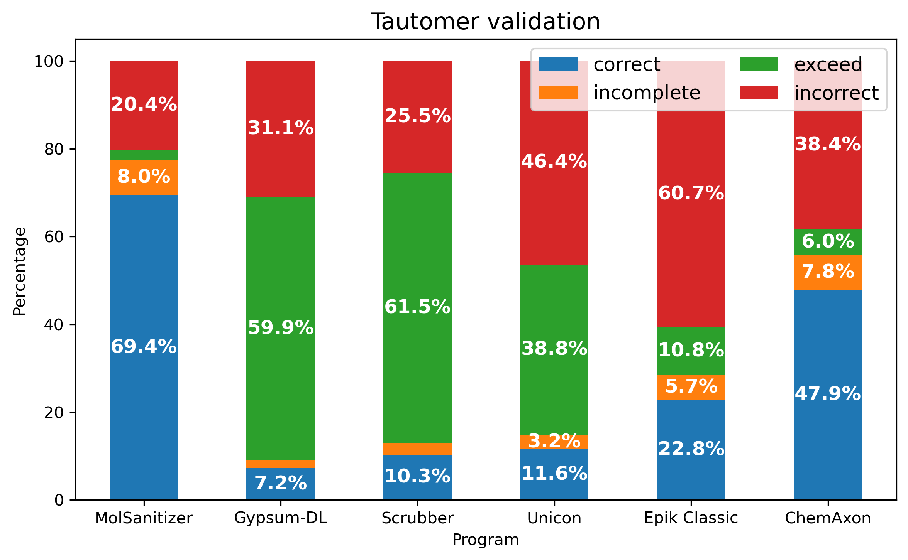
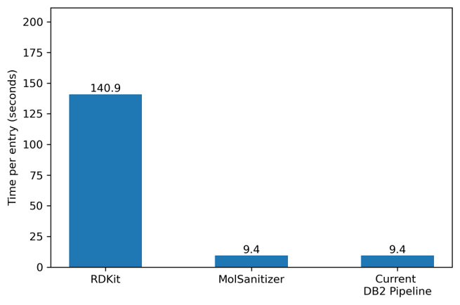
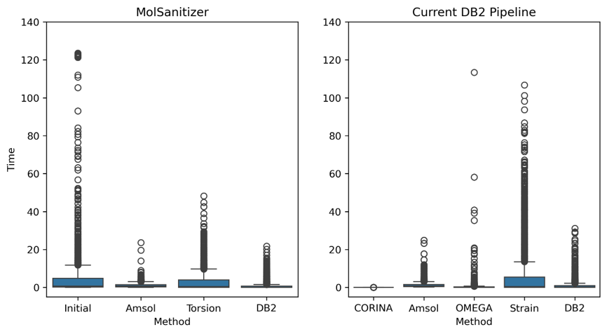
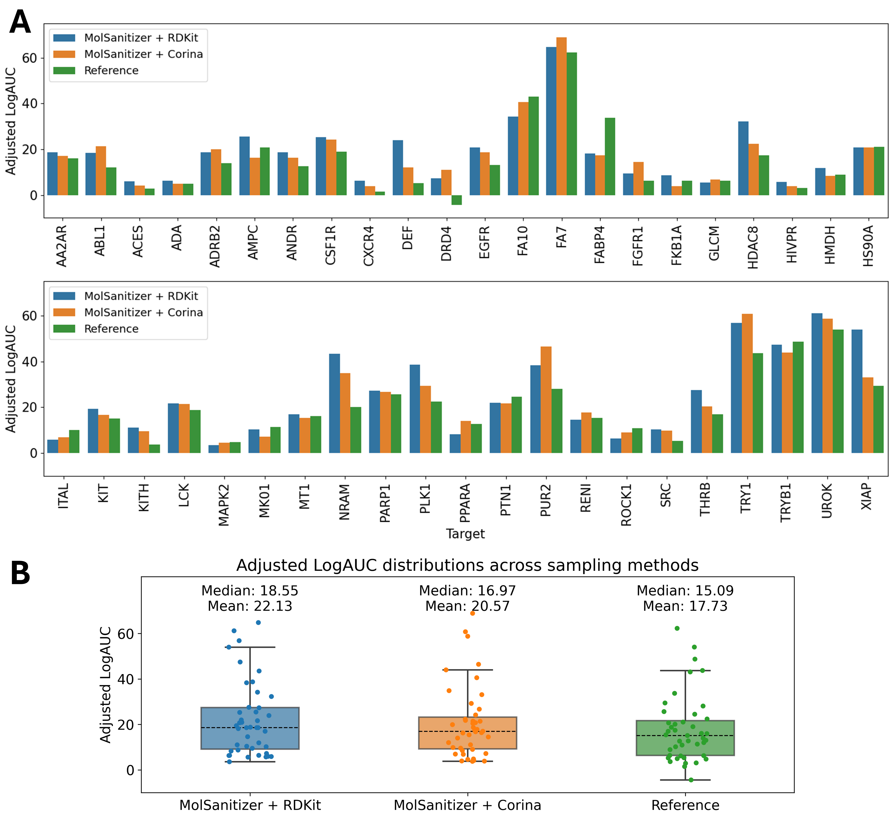
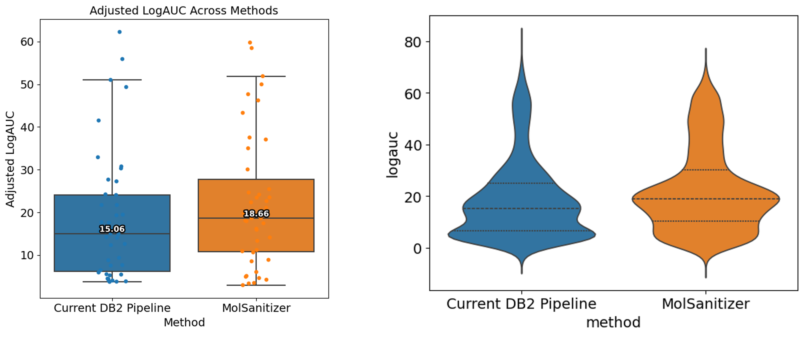

Validation
############
.. _validation:

Tautomerizer Validation
========================

The tautomerization module of MolSanitizer is validated using a subset of 873 tautomer-pair entries in water of the TautoBase [1]_, always starting from the minor tautomeric form, to assess the predictive power of our workflow. For the detailed curation of the dataset, refer to the Supplementary Information. 

Four possible outcomes for each entry could be obtained, including:

- Correct: all the preferred tautomeric forms are captured.
- Incorrect: the predicted forms were not included in the expected results.
- Incomplete: the predicted forms were a part of the expected results.
- Excess: both, the preferred and incorrect tautomeric forms are presented.

The results indicate that MolSanitizer's tautomerization module achieves the highest accuracy with 69.4% of the entries being correctly predicted. The module also shows a lowest rate of incorrect predictions (20.4%), while the incomplete and excess predictions are at 8.0% and 2.2%, respectively.

Ionizer Validation
========================

Two datasets are used to validate the ionization module of MolSanitizer. The first dataset contains only molecules that have only one ionizable functional group (monoprotic set), from three sources (https://www.reaxys.com/), the IUPAC digitalized dataset [2]_ , and the monoprotic molecules database by Lee et al [3]_ . The second database compiled drug-like molecules from three pharmaceutical companies AstraZeneca (AZ), [4]_  Novartis (NV), [5]_ Vertex (VX). [6]_ The latter serves as a more complex yet more realistic test cases for all the benchmarked methods.

.. image:: _static/protonation_validation.png
   :width: 440px
   :align: center

For both the monoprotic and drug-like datasets, MolSanitizer reaches the accuracy of commercial software packages and outperforms free software packages. MolSanitizer reached 85.5% correct prediction rate in the monoprotic and 68.6-76.8% in the drug-like datasets.

Conformer Generator Validation
==============================

Validation of the conformational generation part of MolSanitizer has been conducted based on the two datasets. For bioactive pose reproduction, the Platinum Diverse Dataset [2]_ , and for enrichment capability of the active compounds, the DUDE-Z dataset [3]_ were used. 

Bioactive pose reproduction
---------------------------
Platinum Diverse Dataset contains 2859 high-quality ligand bioactive conformations from the Protein Data Bank (PDB). For the current stage of validation, the best aligned conformation from both MolSanitizer and the current DB2 pipeline employed in the ZINC-22 database was used. As another reference, we used the RDKit's srETKDGv3 conformer generator, coupled with the MMFF94s minimization.

The number of conformers were set to 2000 for RDkit, MolSanitizer and the DB2 pipeline. The RMSD values were calculated based on the heavy atoms of the generated and the reference conformer using the RDKit's GetBestRMS function. 

.. image:: _static/Platinum.png
  :width: 800px

All the three methods reproduce comparable results with the RMSD values less than 0.5 Å. However, when it comes to higher regions of RMSD values such as 1.0 Å, MolSanitizer starts to outperform the current DB2 pipeline. Although RDKit seems to be very efficient in reproducing the bioactive conformation, the number of conformations generally more than the other methods, and the time of processing were mainly the constraints of RDKit being used as a conformation generator for DOCK3.8. Addtionally, it should be noted that the distance-geometry based method of RDKit could also sample different ring conformations, which could on the one hand helps to cover a more diverse conformational space, but on the other hand, could not be easily be converted to DB2 format for DOCK3.8 as the mol2db2.py software requires the aliphatic ring conformations to be fixed.

Upon inspecting the time contribution to the two conformer generators, it is clear that initial embedding is the bottleneck for MolSanitizer. On the other hand, the strain energy calcuation is the most time-consuming step for current DB2 pipeline. Improvement in the initial embedding step, such as adding the CORINA as an optional conformational embedding, of MolSanitizer is expected to reduce the time of processing.

Enrichment capability
---------------------

DUDE-Z is a comprehensive and challenging test set designed for evaluating molecular docking methods. It includes 2,312 ligands and 69,994 property-matched decoys, covering 43 diverse targets. For this benchmark, all methods were tested with a fixed number of 2,000 conformers. The evaluation metric used is the adjusted Log-AUC, which assesses early enrichment performance as recommended by Stein et al [2]_. 

MolSanitizer demonstrates superior performance compared to the current DB2 pipeline in 27 out of the 43 targets. The average adjusted Log-AUC achieved by MolSanitizer is 18.66, significantly higher than the DB2 pipeline's average of 15.06. In cases where MolSanitizer underperforms, the enrichment scores are already either very high (>30) or very low (<10), and the differences are insignificant.

The left panel below illustrates the distribution of adjusted Log-AUC values observed for both MolSanitizer and the DB2 pipeline. The right panel displays bootstrapped results from 500 runs for each target, offering further insight into the robustness of these methods.

References
------------
.. [1]	Wahl, O.; Sander, T. Tautobase: An Open Tautomer Database. J. Chem. Inf. Model. 2020, 60 (3), 1085-1089. https://doi.org/10.1021/acs.jcim.0c00035.
.. [2] Zheng, J.; Chalk, S.; Lafontant-Joseph, O.; Li, Y. IUPAC Digitized pKa Dataset  v2.2, 2024. https://doi.org/10.5281/zenodo.13987352.
.. [3] Lee, A. C.; Yu, J.; Crippen, G. M. pKa Prediction of Monoprotic Small Molecules the SMARTS Way. J. Chem. Inf. Model. 2008, 48 (10), 2042-2053. https://doi.org/10.1021/ci8001815.
.. [4] Wenlock, M.; Tomkinson, N. Experimental in Vitro DMPK and Physicochemical Data on a Set of Publicly Disclosed Compounds (CHEMBL3301361). https://doi.org/10.6019/CHEMBL3301361.
.. [5] Liao, C.; Nicklaus, M. C. Comparison of Nine Programs Predicting pKa Values of Pharmaceutical Substances. J. Chem. Inf. Model. 2009, 49 (12), 2801-2812. https://doi.org/10.1021/ci900289x.
.. [6] Settimo, L.; Bellman, K.; Knegtel, R. M. A. Comparison of the Accuracy of Experimental and Predicted pKa Values of Basic and Acidic Compounds. Pharm Res 2014, 31 (4), 1082–1095. https://doi.org/10.1007/s11095-013-1232-z.

.. [7] Friedrich, N. O., de Bruyn Kops, C., Flachsenberg, F., Sommer, K., Rarey, M., & Kirchmair, J. (2017). Benchmarking commercial conformer ensemble generators. Journal of chemical information and modeling, 57(11), 2719-2728. Available at: https://pubs.acs.org/doi/10.1021/acs.jcim.7b00505

.. [8] Stein, R. M., Yang, Y., Balius, T. E., O’Meara, M. J., Lyu, J., Young, J., ... & Irwin, J. J. (2021). Property-unmatched decoys in docking benchmarks. Journal of chemical information and modeling, 61(2), 699-714. Available at: https://pubs.acs.org/doi/10.1021/acs.jcim.0c00598